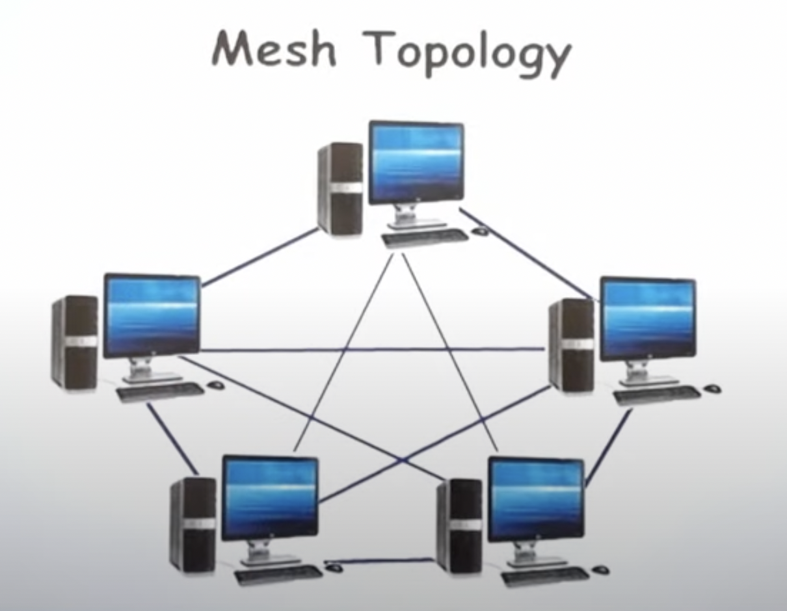
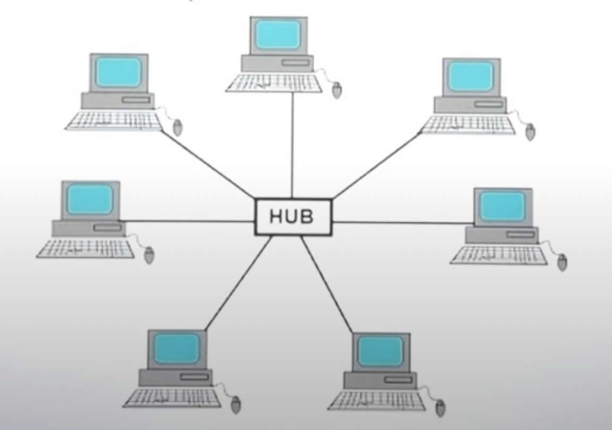
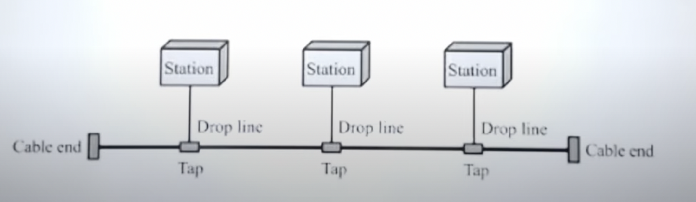
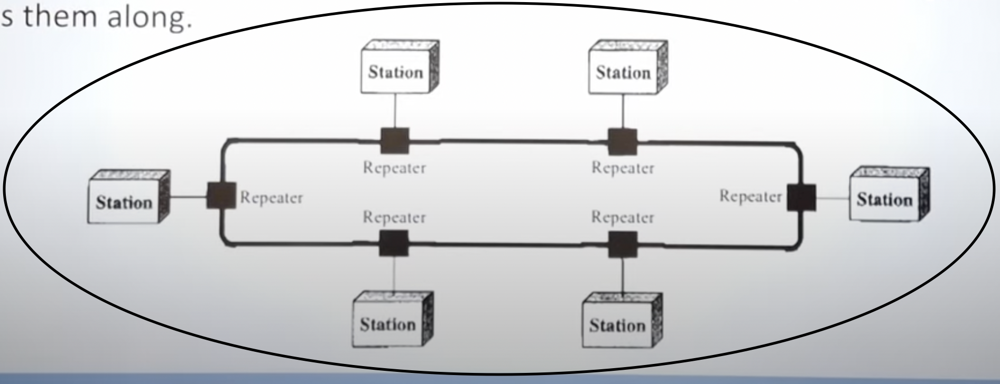

# Topology

### Physical Topology 
- Refers to the way in which a network is laid out physically. It is the geometric representation of all the links and linking devices to one another.

## Types of Topology:

### Mesh Topology
* Every device has a dedicated point to point link to every other device 
* In mesh topology, we need , n*(n-1)/2 duplex mode links where n is the number of nodes 
* **Advantages**
  * Each connnection carries it's own load, hence eliminating traffic problems
  * It is robust. If one link becomes unusable, it does not hamper the functioning.
  * There is privacy between two nodes.
  * Fault identification and isolation is easy. Traffic can also be routed to avoid problems.
* **Disadvantages**
  * Installation and reconnection are difficult because of large amount of connection required to connect each node with each other
  * The physical amount of wires required is difficult to manage in limited space
  * The hardware required is expensive.

### Star Topology
* Each device has a point to point link to a central controller usually called a hub. There is no direct link between any device.
* The controller acts as an exchange. It relays data from one node to another.
* **Advantages**
  * Less expensive than mesh
  * Easy to install and reconfigure
  * It is robust. 
  * Easy fault identification and isolation
* **Disadvantages**
  * Dependency on a single point. If the hub goes down, then the whole system will fail
  * Amount of wires/connections required are still very large O(N)

### Bus Topology
* It is multipoint. All the devices are connected to one long cable which acts as spine.
* Nodes are connected using drop lines and taps
* Drop Line: connection between node and main cable
* Tap: It is a connector that either splices into or punctures the main cable to create a contact with the metallic core.
* **Advantages**
  * Ease of installation
  * Less wiring than above 2
* **Disadvantages** 
  * Reconnection and fault isolation because the medium is shared
  * Difficult to add new devices to network
  * A fault in the main cable/bus will break the whole network

### Ring Topology
* Each device has a dedicated point to point connection with only it's left and right neighbours
* Message is passed in a ring from one node to another till it reaches it's destination
* **Advantages** 
  * Easy to install and reconfigure
  * Fault isolation is simplified
* **Disadvantages**
  * Low security
  * A break in the ring can disable the entire station.

