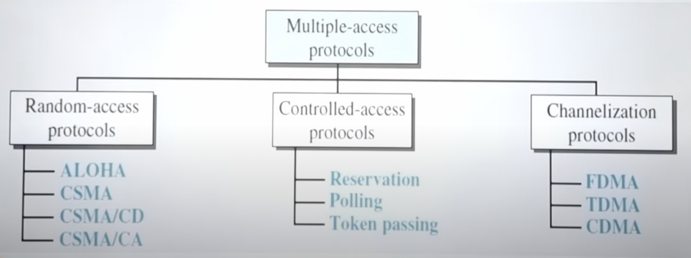
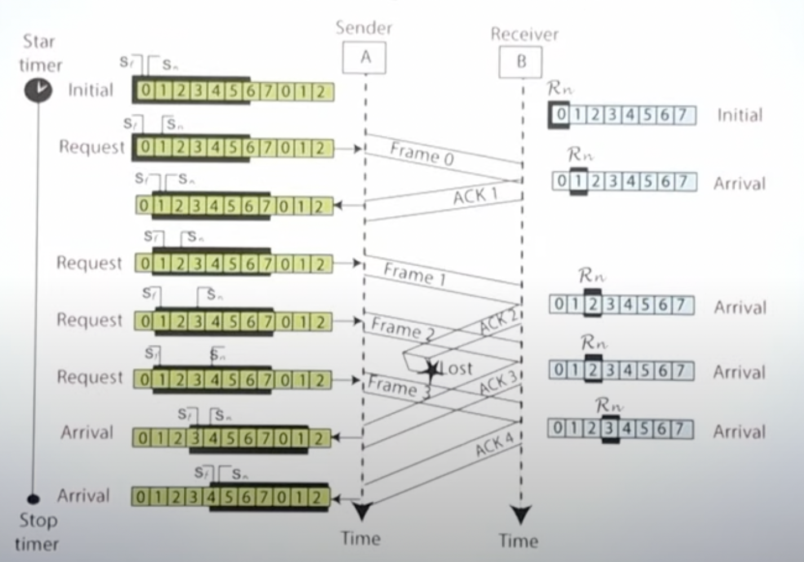
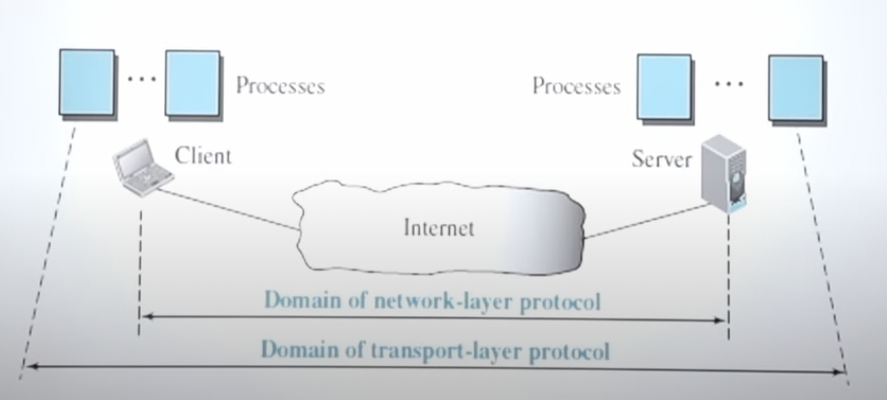

# Network Models

* **Layered Task**: International Standard Organisation proposed an Open System Interconnection model which allows two systems to communicate with each other regardless of their architecture

* The OSI model is not a protocol. It is a model for understanding and designing a network architecture that is robust, flexible and interoperable
* It consists of seven separate but related layers each of which defines a part of the process of moving information across a network

## Physical Layer

* The physical layer defines the characteristics of the interface between the devices and the transmission medium
* **Representation of bits** : The physical layer data consists of a stream of bits with no interpolation. For transmission, bits must be encoded into signals- electrical or optical
* **Data transmission rate** is also defined by the physical layer
* **Line Configuration**: Type of connection of the devices to the media (point to point, multipoint)
* **Physical Topology** is depends on physical layer
* **Transmission Mode**: Simplex, Half Duplex, Full Duplex is also defined by physical layer

## Data Link Layer

* **Framing** - The data link layer divides the stream of bits received from the network layer into manageable data units called frames.
  

* **Physical Addressing** - If frames are to be distributed to different systems on the network, the data link layer adds a header to the frame to define the sender/receiver of the frame

* **Access Control** - When 2 or more devices are connected on the same link, data link layer protocols are necessary to determine which device has control over the link at any given time
  

* **Flow Control** - If the rate at which the data is absorbed by the receiver is less than the rate at which data is produced by the sender, the data link layer imposes a flow control mechanism to avoid overwhelming the receiver
  

* **Error Control** - The data link layer adds reliability to the physical layer by adding mechanisms to detect and retransmit damaged or lost frames. It also uses a mechanism to recognise duplicate frames. Error control is normally achieved through a trailer added to the end of the frame.
 

## Network Layer

* The network layer is responsible for the source to destination delivery of a packet, possibly across multiple networks(links)
  

* **Logical Addressing** - If a packet passes a network boundary, we need another addressing system to help distinguish the source and destination systems. The network layer adds a header to the packet coming from the upper layer that includes the logical address of the sender and the receiver.
  

* **Routing** - When independent network or links are connected to create inter-networks of a large network, the connecting devices route or switch the packets to their final destination. This is one of the functions of network layer.
  

## Transport Layer

* **Service Point Addressing** - The transport layer header must include a address called a service point address(port address). The network layer gets each packet to correct computer, the transport layer gets the message to the correct process on that computer. The transport layer is responsible for process to process delivery of the entire message.
  

* **Segmentation and Reassembly** - A message is divided into transmittable segments, with each segment containing a sequence number. These numbers enable the transport layer to reassemble the message correctly upon arriving at the destination and to identify and replace packets that were lost in transmission.
  

* **Connection Control** - The transport layer can either be connectionless or connection oriented. A connectionless transport layer treats each segment as an independent packet and delivers it to the transport layer at the destination machine. A connection oriented transport layer makes a connection with the transport layer at the destination machine first before delivering the packets. After all the data is transferred, the connection is terminated.
  

* **Flow Control** - Like the data link layer, the transport layer is responsible for flow control at this level. Flow control at this layer is performed end to end rather than across a single link.
  

* **Error Control** - Error control at this layer is performed process to process rather than across a single link. The sending transport layer makes sure that the entire message arrives at the receiving transport layer without error (damage, loss or duplication). Error correction is usually achieved through retransmission.
  

## Session Layer

* The session layer is the network dialog controller. It establishes, maintains, and synchronizes the interaction among communication systems.
* The session layer is responsible for dialog control and synchronization
* **Dialog Control** - The session layer allows 2 systems to enter into a dialog. It allows the communication between two processes to take place in either half duplex or full duplex mode
* **Synchronisation** - The session layer allows a process to add checkpoints, or synchronization points, to a stream of data

## Presentation Layer

* **Translation** - The processes in 2 systems are usually exchanging information in the form of characters, numbers, etc.
* The information must be converted to bit stream before being transmitted. Since different systems use different encodings, the presentation layer allows for the interoperability between the 2 systems.
* The presentation layer at the sender changes the info there into a common format, and at the receiver it is converted back into original
* **Encryption** - The presentation layer does encryption and decryption
* **Decryption** - Data compression reduces the number of bits in the transmission

## Application Layer

* Application layer enables the user to access the network
* It provides user interfaces and support for services such as electronic mail, remote file access and transfer, shared database management, and other types of distributed information services
* **Services** :
  * **Network Virtual Terminal** - It is a software version of a physical terminal and it allows a user to login to a remote host. To do so, the application creates a software emulation of a terminal at the remote host. The user's computer talks to the software terminal which talks to the host. The remote host believes, it is communicating with one of it's own terminals and allows the user to log in.
  * **File Transfer Access And Management** - The application allows a user to access files in a remote host, to retrieve files from a remote computer for use in the local computer, and to manage or control files in a remote computer locally.
  * **Mail Services** - The application provides the basis for email forwarding and storage.
  * **Directory Services** - The application provides distributed database sources and access for global information about various objects and services.

# Transmission media 
Can be broadly defined to be anything that can carry information from source to destination

