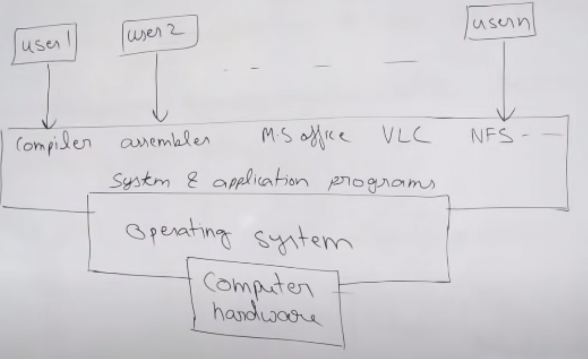

# OPERATING SYSTEM

Operating system is a system software
* It acts as an intermediary between hardware and software
* It manages system resources in an unbiased manner, both software and hardware
* Provides a platform on which other applications are installed

**Goals of Operating System** :
* Primary goal is to provide convenience and user friendliness
* Secondary goal is to provide efficiency

**Functions of Operating System** :
* Process management
* Memory management
* I/O device management
* File management
* Network Management
* Security and Protection

