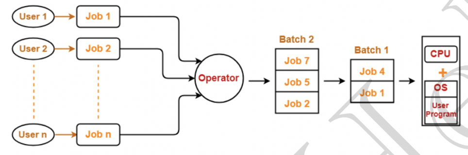

# Batch Operating System/Spooling

## History
* In starting mainframe computers
  * common input and output devices were card readers and tape drives
  * users prepared a JOB which consisted of program, input and control instructions
  * JOB is given in the form of punch cards and result also appeared in the form of punch cards
  * So OS was very simple
  * It was always present in memory
  * Major task was to transfer the control from one JOB to another

## Batch Processing

* Jobs with similar needs are batched together and processed through the processor as a group
* Operator sorts jobs as a deck of punch cards into batches of similar needs
* eg. FORTRAN batch, COBOL batch etc.
* **Advantages** :
  * In a batch, jobs execute one after the another saving time in operations like loading and deloading the compiler etc.
  * During a batch operation no manual intervention is needed
* **Disadvantages** :
  * CPU idle time is still high
  * Memory limitation
  * Interaction of I/O devices directly with CPU
  * May lead to starvation due some batch taking too long

